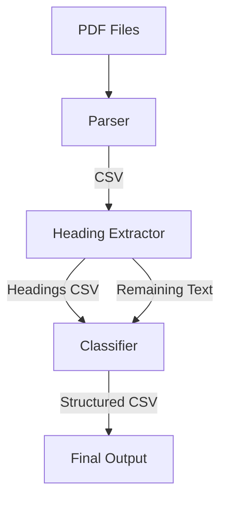

# 📄 PDF Heading Extractor & Classifier

This project parses PDF documents, extracts headings, and classifies the remaining text into structured data. The pipeline combines **PDF parsing**, **heading extraction using NLP models**, and **text classification using ML algorithms**, producing a clean CSV output for further analysis.

---

## 🚀 Project Workflow

---

## 🧩 Components

### 1️⃣ Parser
Parses raw PDF documents and extracts text into CSV format.  
**Libraries used:**
- [PyMuPDF](https://pymupdf.readthedocs.io/en/latest/)  
- [pypdf](https://pypdf.readthedocs.io/en/stable/)  
- [pdfplumber](https://github.com/jsvine/pdfplumber)  

---

### 2️⃣ Heading Extractor
Identifies headings and structures the document hierarchy.  
**Models explored:**
- [DiBERTa](https://huggingface.co/microsoft/deberta-base)  
- [bert-tiny-ml](https://huggingface.co/google/bert_uncased_L-2_H-128_A-2)  
- [ELECTRA](https://huggingface.co/docs/transformers/model_doc/electra)  

---

### 3️⃣ Classifier
Classifies the remaining text (non-headings) into categories.  
**Algorithms used:**
- [XGBoost](https://xgboost.readthedocs.io/)  
- [Random Forest](https://scikit-learn.org/stable/modules/generated/sklearn.ensemble.RandomForestClassifier.html)  
- [Naïve Bayes](https://scikit-learn.org/stable/modules/naive_bayes.html)  

---

## 📂 Output
The pipeline generates:
- **Headings CSV** → Extracted headings with hierarchy levels  
- **Classified CSV** → Classified text segments mapped under respective headings  

---

## 📊 Example

Input: `research_paper.pdf`  
Output:  
- `headings.csv` (list of extracted headings)  
- `classified.csv` (structured classified text under headings)  

---

## 🔮 Future Enhancements
- Improve heading extraction accuracy with fine-tuned NLP models  
- Support multi-column and scanned PDFs (OCR integration with Tesseract)  
- Export results to JSON for easier integration with other tools  

---

## 🤝 Contributing
Pull requests are welcome. For major changes, please open an issue first to discuss what you’d like to change.

---
